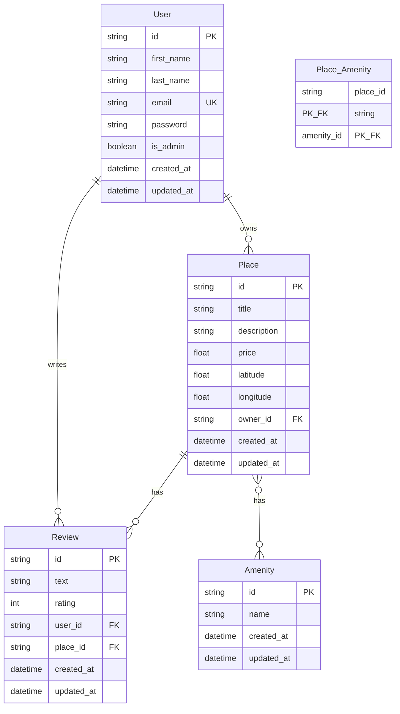

# DB Diagram

```mermaid
erDiagram
    User ||--o{ Place : owns
    User ||--o{ Review : writes
    Place ||--o{ Review : has
    Place }o--o{ Amenity : has
    
    User {
        string id PK
        string first_name
        string last_name
        string email UK
        string password
        boolean is_admin
        datetime created_at
        datetime updated_at
    }
    
    Place {
        string id PK
        string title
        string description
        float price
        float latitude
        float longitude
        string owner_id FK
        datetime created_at
        datetime updated_at
    }
    
    Review {
        string id PK
        string text
        int rating
        string user_id FK
        string place_id FK
        datetime created_at
        datetime updated_at
    }
    
    Amenity {
        string id PK
        string name
        datetime created_at
        datetime updated_at
    }
    
    Place_Amenity {
        string place_id PK_FK
        string amenity_id PK_FK
    }
```

